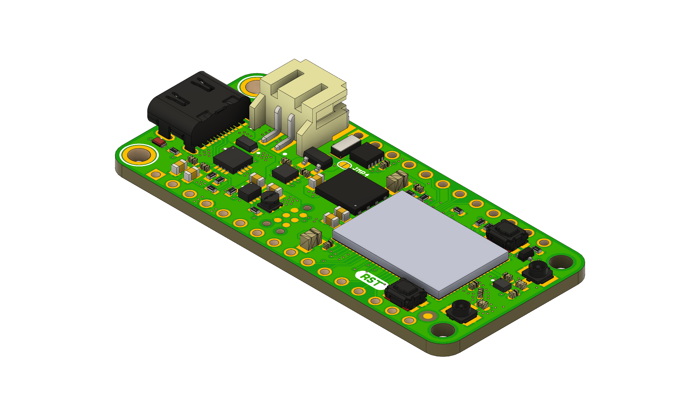

# Circuit Dojo - nRF9160 Feather Hardware Files

## Purchase

Considering supporting the project and purchasing a nRF9160 Feather at the following locations:

1. [The Circuit Dojo Official Store](https://www.circuitdojo.com/products/nrf9160-feather)
2. [Digikey](https://www.digikey.com/en/products/detail/circuit-dojo/PASSY-NRF9160-FEATHER/13668137)

## Code

All code for this board can be [found here.](https://github.com/circuitdojo/nrf9160-feather-examples-and-drivers/tree/v1.9.x)

## Documentation

[Documentation is available here.](https://docs.circuitdojo.com)

## License

Hardware released under the CERN Open Hardware Licence Version 2 - Weakly Reciprocal. See **LICENSE.txt** for more info.
